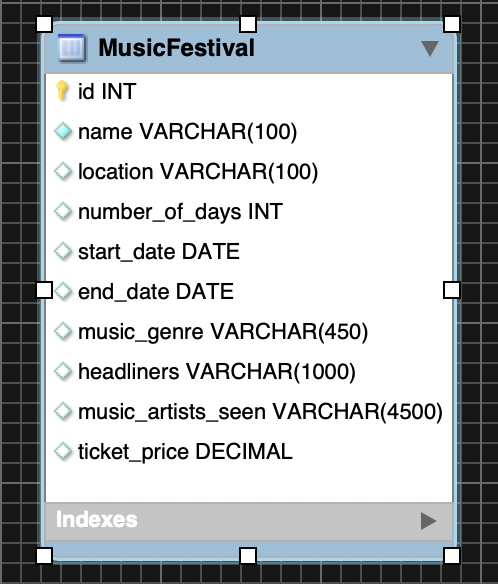

## EventTrackerProject
### Overview
My Event Tracker Project is used to keep track of Music Festivals attended, details about the event (genre of music, ticket price, headlining acts, dates, number of days, location), and list the musical artists I saw there. The program allows users to create, read, update, and delete Music Festival events from a database. It also allows users to make queries to find a list of festival by number of days, keywords in the festivals name, search by the headliner or genre, and find a list of festivals whose ticket prices are in a specific range.
### Description
The project consists of a single table created in MySQL workbench.

The table was then populated with data and a Web Application was created using Spring Boot with the goal of publishing a REST API, using Spring Data JPA to give full CRUD functions on the MusicFestivalTable, and have all that be tested using Postman.
The test conditions for the project were:
  * A new event object implements full CRUD.  
  * All interactions with the database are done so RESTfully.

### Routes
  | Return Type          | Route                  | Functionality                                                                       |
  |----------------------|------------------------|-------------------------------------------------------------------------------------|
  | `List<MusicFestival>`|`GET api/musicfestivals`                                | Gets all music festivals                            |
  | `List<MusicFestival>`|`GET api/musicfestivals/{musicFestId}`                  | Gets one music festivals  by id                     |
  | `List<MusicFestival>`|`POST api/musicfestivals`                               | Creates a new music festivals                       |
  | `List<MusicFestival>`|`PUT api/musicfestivals/{musicFestId}`                  | Updates details in an existing music festivals by id|
  | `Boolean`            |`DELETE api/musicfestivals/{musicFestId}`               | Replaces an existing music festivals  by id         |
  | `List<MusicFestival>`|`GET api/musicfestivals/search/{keyword}`               | Finds music festivals by keyword in its name        |
  | `List<MusicFestival>`|`GET api/musicfestivals/searchByGenre/{genre}`          | Finds music festivals by genre                      |
  | `List<MusicFestival>`|`GET api/musicfestivals/search/price/{low}/{high}`      | Finds music festivals with tickets priced in range  |
  | `List<MusicFestival>`|`GET api/musicfestivals/searchByDays/{numOfDays}`       | Finds music festivals by number of days             |
  | `List<MusicFestival>`|`GET api/musicfestivals/searchByHeadliners/{headliners}`| Finds music festivals by headlining acts            |

### Technologies Used
```
* Java
* JUnit
* POJO
* Postman
* REST API
* HTTP
* CRUD
* Spring Boot
* Spring Data JPA
* JPA
* MySQL Workbench
* Git/ GitHub
* MAMP
* Gradle
* AWS EC2
* Apache Tomcat
```
### Lessons Learned
